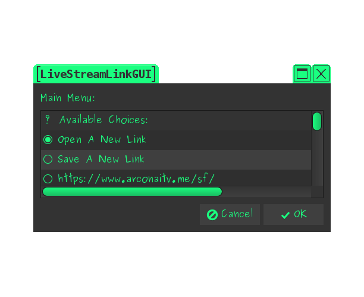

# LiveStreamLinkGUI

This is LiveStreamLinkGUI. It's a lightweight GUI for Livestreamer, Streamlink, and any future forks. I made it for the personal use of my family and myself, but when I looked around, I saw people making requests for things I've already implemented. So I decided to share it. Its only requirements are BASH, rtmpdump, and zenity. I wrote it in Linux, for Linux, but because it's a BASH script, it should (in theory) work for any platform that supports BASH and its requirements. I hear Win10 has some kind of BASH support but I have no idea how capable it is of running this or any other script.

## Features
### Open Chats
Some websites have popout chats, such as twitch and vaughnlive. When you give LiveStreamLinkGUI a link for one of these sites, it can ask if you want to open the chat for that stream in your browser. It's important to know only the chat will be opened. So you don't have to worry about your browser eating up a lot of your system resources just to take part in the chat. I designed LiveStreamLinkGUI in a way where adding support for other sites shouldn't be difficult at all. All you need to know is the popout chat's URL and how to parse it.

### Save Links
LiveStreamLinkGUI can save your favorite links. This makes it easy to keep track of streams you watch a lot and even open them without running your browser. You can also name links. Simply put the name before the link when saving. For example: "Don't Do Drugs https://d12gmupx1a6wc4.cloudfront.net/media3/001/206/355/7mvR_360.mp4" If you've been using LiveStreamLinkGUI and want to add names to already existing links, you can do so by editing the file at: $configdir/history.

### Loop Forever
If the stream is lost or closed for whatever reason, you have the option to "loop forever". While doing so, LiveStreamLinkGUI will keep trying to reopen the stream until the script is manually killed. This is best used in a media setup, so you can keep watching your streams while you fall asleep, work, clean the house, or whatever. It works very well with the shutdown command. An example of the shutdown command (which can differ from distro to distro) is `sudo shutdown -hP {minutes}`, which will shutdown the system after the specified number of minutes. So it's similar to sleepmode for TVs.

### Dig for URL
When you give LiveStreamLinkGUI a link, it will check to see if the link is a direct link to a media file. If it's not, it will then check to see if a plugin exists for the link. If no plugin is found, it will then "dig" through a link and search for common video types and automatically pipe them into the video player. For example, you could give LiveStreamLinkGUI this link, "https://www.ispot.tv/ad/7mvR/the-partnership-at-drugfreeorg-awkward-silence" and LiveStreamLinkGUI will automatically find the video link and play it, even though neither Livestreamer or Streamlink support the site. So how do you use it? The same as you would for any link! It's automatic!

### Ping sites
It's now possible to ping live streams and sites automatically when you launch LiveStreamLinkGUI. If a live stream is available, a message will appear next to the link that says "(Online!)", if the stream is hosting another stream, it will say "(Hosting)", and if the stream is offline, it will say "(Offline)". Pretty neat, huh? So how do you make use of it? Simply put LSLGUIping in the stream's name. For example, "Hey I know this guy! LSLGUIping He loves pizza! https://www.twitch.tv/sirclare" and LiveStreamLinkGUI will take care of the rest.
#### NOTE1: This can greatly increase the time it takes to load a menu, especially if you set it up to ping 15+ streams. If you enjoy how quick LiveStreamLinkGUI starts up, then you can ignore this feature.
#### NOTE2: This is still experimental and so far only works well for live streams.

### Additional sites
I've added support for sites like twit.tv, roosterteeth.com, and a few other sites. LiveStreamLinkGUI is designed so that adding support for other sites shouldn't be much of a chore.

### Additional Media
LiveStreamLinkGUI doesn't just support streams. It also supports direct links to media. Including remote media and local media on your computer. And if you want to watch something on a webpage but don't have the direct link to it, LiveStreamLinkGUI will "dig" for it automatically.

### Configurations
All of the user specific configurations are at the top of the script. I would recommend going through them before running the script, but there is also a first time setup GUI which will help take you through the more basic configurations.

## How to use
If you want to open a new stream, all you have to do is execute the script and select "Open A New Link". A text input box will appear and you can drag and drop the link to that text box and click "OK". You can also copy-paste the link or manually type it in, if you so choose.

When the player closes, you're presented with a list of options. You can reopen it (if the stream is online), save the link for future use, loop it forever, open a new stream, open a saved stream, etc, etc. To save you a click, selecting "Close Program", is the same as clicking "Cancel", pressing ESC, or closing the window in any other way. So you don't have to scroll to the bottom every time you're done with the script.

For ease of use, I have a launcher for LiveStreamLinkGUI in my DE's panel. For media machines, I also keep a launcher for timed shutdowns. It makes it very easy to watch streams while falling asleep using only a pointer device. I'm not telling you what to do, I'm just telling you what I do.

As a side note, there's a VLC script that allows VLC to play Youtube playlists. Naturally, LiveStreamLinkGUI gets along very well with this.

## Last but not least...
Feel free to make whatever changes you want with this. If you make a change, such as adding chat support for other sites, or site support for any sites livestreamer/streamlink don't support, please let me know so I can add the changes too. If you redistribute this script, I would like to ask that you please give me credit as "Mouse". Thank you and enjoy!
